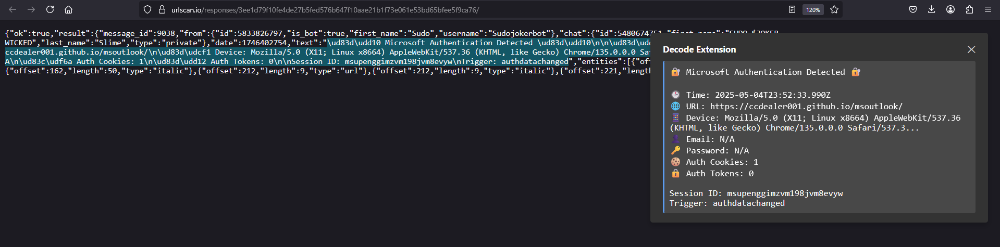

# Decode Extension for Firefox and Chrome

  

**Decode Extension** is a browser extension for Firefox and Chrome that allows users to decode URL-encoded, Base64-encoded, Hex-encoded, and Unicode-escaped strings directly from the context menu. With a simple right-click, you can decode selected text and view the result in a toast notification, making it a handy tool for web developers, security researchers, and anyone who frequently encounters encoded strings.

## Table of Contents

- [Why Use This Extension](#why-use-this-extension)
- [Installation](#installation)
  - [Firefox Installation](#firefox-installation)
  - [Chrome Installation](#chrome-installation)
  - [Permanent Installation](#permanent-installation)
- [Usage](#usage)
- [How It Works](#how-it-works)
- [Screenshots](#screenshots)
- [Permissions](#permissions)
- [Troubleshooting](#troubleshooting)
- [For Developers](#for-developers)
- [Limitations](#limitations)
- [License](#license)

## Why Use This Extension

Encoded strings, such as URL-encoded (`https%3A%2F%2Fexample.com`), Base64-encoded (`aHR0cHM6Ly9leGFtcGxlLmNvbQ==`), Hex-encoded (`48656C6C6F`), or Unicode-escaped (`\u00A9` or `&#x1F600;`) text, are common in web development, security analysis, and data handling. Decoding these manually or with external tools can slow you down. This extension offers a fast, in-browser solution to decode selected text instantly, enhancing your productivity.

- **Web Developers**: Decode query parameters or encoded URLs while debugging.
- **Security Researchers**: Analyze obfuscated strings in phishing attempts or scripts.
- **General Users**: Decode text from webpages without leaving the browser.

## Installation

### Firefox Installation

#### Temporary Installation for Testing

1. Clone or download this repository to your local machine.
2. Open Firefox and type `about:debugging` in the address bar, then press Enter.
3. Click **"This Firefox"** in the left sidebar.
4. Click **"Load Temporary Add-on…"**.
5. Navigate to either:
   - `manifest_version_3` directory and select `background.js` (for Firefox 109 or higher, recommended).
   - `manifest_version_2` directory and select `background.js` (for older Firefox versions).

The extension will be active until you restart Firefox.

### Chrome Installation

#### Temporary Installation for Testing

1. Clone or download this repository to your local machine.
2. Open Chrome and type `chrome://extensions/` in the address bar, then press Enter.
3. Enable **Developer mode** (toggle in the top-right corner).
4. Click **Load unpacked**.
5. Navigate to the `manifest_version_3` directory and select it (ensure `background.js` is in the directory).

The extension will be active until you disable or remove it.

### Permanent Installation

To install the extension permanently:

1. Zip the contents of the appropriate directory:
   - For Firefox: Use `manifest_version_2` or `manifest_version_3` based on your Firefox version.
   - For Chrome: Use `manifest_version_3`.
   - Ensure `background.js` is at the root of the zip.
2. Rename the `.zip` file to end with `.xpi` for Firefox or `.crx` for Chrome (e.g., `decode-extension.xpi` or `decode-extension.crx`).
3. Drag and drop the file into Firefox or Chrome.
4. Confirm the installation when prompted by the browser.

You can also submit the extension to the [Firefox Add-ons Store](https://addons.mozilla.org/) or [Chrome Web Store](https://chrome.google.com/webstore/) for broader distribution.

## Usage

Using the extension is simple:

1. **Highlight** an encoded string on a webpage (e.g., `https%3A%2F%2Fexample.com`, `aHR0cHM6Ly9leGFtcGxlLmNvbQ==`, `48656C6C6F`, or `\u00A9`).
2. **Right-click** the selected text to open the context menu.
3. Select one of the following options:
   - **"Decode as URL-encoded"**: Decodes URL-encoded strings (e.g., `https://example.com`).
   - **"Decode as Base64-encoded"**: Decodes Base64-encoded strings (e.g., `https://example.com`).
   - **"Decode as Hex"**: Decodes Hex-encoded strings (e.g., `48656C6C6F` → `Hello`).
   - **"Decode as Unicode Escape"**: Decodes Unicode escape sequences (e.g., `\u00A9` → `©`, `&#169;` → `©`).
4. View the decoded result in a toast notification within the browser window.

**Note**: If the text isn't a valid encoded string, an error message will appear in the notification.

## How It Works

The extension uses WebExtension APIs to provide decoding functionality:

- **Context Menu**: The `contextMenus` API adds "Decode as URL-encoded", "Decode as Base64-encoded", "Decode as Hex", and "Decode as Unicode Escape" options to the right-click menu when text is selected.
- **Decoding**: The `scripting` API runs a function in the active tab to decode the selected text using:
  - `decodeURIComponent()` for URL-encoded strings.
  - `atob()` for Base64-encoded strings, with intelligent detection for hex-like input that might look like base64.
  - Hex decoding by converting pairs of hex digits to characters using `parseInt(hex, 16)` and `String.fromCharCode`.
  - Unicode escape decoding that handles `\uXXXX`, `\u{XXXXX}`, `&#XXXXX;`, and `&#xXXXX;` formats using regular expressions and `String.fromCodePoint`.
  - Automatic parsing of common escaped characters like `\n`, `\t`, `\r` regardless of the decoding type used.
- **Output**: The decoded result (or an error message) is displayed in a toast notification that appears in the top-right corner of the browser window. The notification includes a close button and remains visible for 30 seconds, allowing users to easily copy the decoded text.

## Screenshots

The following screenshots demonstrate the extension in action, decoding obfuscated strings often found in phishing analysis (e.g., from [urlscan.io](https://urlscan.io/responses/ef5817fd51c75f45f9bbd5c35df8bc9c02cf158e614f3767ff8ee86c57be8cb1/)):

The following screenshots show how escaped characters are automatically rendered.

https://urlscan.io/responses/3ee1d79f10fe4de27b5fed576b647f10aae21b1f73e061e53bd65bfee5f9ca76/

## Permissions

The extension requires these permissions:

- **`contextMenus`**: Adds decoding options to the right-click menu.
- **`activeTab`**: Accesses the current tab to process selected text.
- **`scripting`**: Executes the decoding function within the tab.

These permissions ensure the extension can interact with webpages and handle user selections.

## Troubleshooting

- **Firefox: "background.service_worker is currently disabled"**:
  - Occurs on Firefox versions before 109 that don’t support Manifest V3 service workers.
  - **Solution**: Use the `manifest_version_2` directory (Manifest V2) for older Firefox versions, or update Firefox to version 109 or higher (recommended, versions 126+ as of May 2025).
- **Chrome: Extension Not Loading**:
  - Ensure you’re using the `manifest_version_3` directory with Manifest V3.
  - Check the Chrome Extensions page (`chrome://extensions/`) for errors and verify Developer mode is enabled.
- **Context Menu Not Appearing**:
  - Ensure text is selected before right-clicking.
  - Reload the extension (Firefox: `about:debugging`, Chrome: `chrome://extensions/`) and check the console for errors (`Ctrl+Shift+J`).
- **Base64 Decoding Issues with Hex-like Data**:
  - The extension now intelligently detects when input that looks like hex (space-separated values, comma-separated values, or 0x-prefixed) is selected for base64 decoding and will handle it appropriately.
  - If you're still seeing issues, try using "Decode as Hex" directly for hex-formatted data.
- **Other Decoding Errors**:
  - Verify the selected text is a valid URL-encoded, Base64-encoded, Hex-encoded, or Unicode-escaped string.
  - Non-standard encodings may not be supported.

## For Developers

Want to modify or contribute to the extension? Here’s how:

- **Directory Structure**:
  - `manifest_version_3/`: Contains Manifest V3 files for Chrome and modern Firefox (109+).
    - `background.js`: Logic for menu creation and decoding.
  - `manifest_version_2/`: Contains Manifest V2 files for older Firefox versions.
    - `background.js`: Logic for menu creation and decoding.
  - `screenshot-01.png`, `screenshot-02.png`: Example images of the extension in use.
  - `LICENSE`: MIT License file.
- **Making Changes**:
  - Edit `background.js` in the appropriate directory to tweak decoding logic or add features.
  - Update the `manifest.json` files for configuration adjustments (e.g., permissions, name).
- **Testing**:
  - Firefox: Use the [Firefox Installation](#firefox-installation) steps.
  - Chrome: Use the [Chrome Installation](#chrome-installation) steps.

Contributions are welcome! Fork the repository and submit a pull request with your improvements.

## Limitations

- **Main Document Only**: Works on the main webpage, not within iframes or embedded content.
- **Basic Decoding**: Uses `decodeURIComponent`, `atob`, hex decoding, and Unicode escape decoding, which may not handle non-standard or multi-layered encodings.
- **Toast Notification**: Results appear in a toast notification with selectable text and a close button, allowing for easy copying.
- **Error Messages**: Invalid input now provides descriptive error messages with suggestions (e.g., suggesting to use "Decode as Hex" when base64 decoding fails on hex-like input).

Recent improvements include:
- Robust base64 decoding that handles ambiguous input (hex-formatted data that might be selected as base64)
- Automatic parsing of escape sequences like `\n` and `\t` in all decoded text
- Improved toast notification display with proper whitespace preservation
- Descriptive error messages with helpful suggestions

Future updates could add support for more encodings or additional display options.

## License

This project is licensed under the [MIT License](LICENSE). See the [LICENSE](LICENSE) file for details.

*Last updated: Monday, May 19, 2025 - Added base64 decoding improvements and escaped character handling*