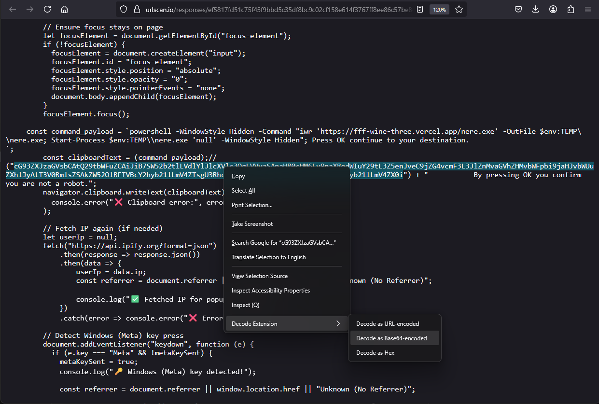

# Decode Extension for Firefox

 

**Decode Extension** is a Firefox browser extension that allows users to decode URL-encoded or Base64-encoded strings directly from the context menu. With a simple right-click, you can decode selected text and view the result in an alert box, making it a handy tool for web developers, security researchers, and anyone who frequently encounters encoded strings.

## Table of Contents

- [Why Use This Extension](#why-use-this-extension)
- [Installation](#installation)
  - [Temporary Installation for Testing](#temporary-installation-for-testing)
  - [Permanent Installation](#permanent-installation)
- [Usage](#usage)
- [How It Works](#how-it-works)
- [Permissions](#permissions)
- [For Developers](#for-developers)
- [Limitations](#limitations)
- [License](#license)

## Why Use This Extension

Encoded strings, such as URL-encoded (`https%3A%2F%2Fexample.com`) or Base64-encoded (`aHR0cHM6Ly9leGFtcGxlLmNvbQ==`) text, are common in web development, security analysis, and data handling. Decoding these manually or with external tools can slow you down. This extension offers a fast, in-browser solution to decode selected text instantly, enhancing your productivity.

- **Web Developers**: Decode query parameters or encoded URLs while debugging.
- **Security Researchers**: Analyze obfuscated strings in phishing attempts or scripts.
- **General Users**: Decode text from webpages without leaving Firefox.

## Installation

### Temporary Installation for Testing

To test the extension without packaging it:

1. Clone or download this repository to your local machine.
2. Open Firefox and type `about:debugging` in the address bar, then press Enter.
3. Click **"This Firefox"** in the left sidebar.
4. Click **"Load Temporary Add-on…"**.
5. Navigate to the extension directory and select the `manifest.json` file.

The extension will be active until you restart Firefox.

### Permanent Installation

To install the extension permanently:

1. Zip the contents of the extension directory (ensure `manifest.json` is at the root of the zip).
2. Rename the `.zip` file to end with `.xpi` (e.g., `decode-extension.xpi`).
3. Drag and drop the `.xpi` file into Firefox.
4. Confirm the installation when prompted by Firefox.

You can also submit the extension to the [Firefox Add-ons Store](https://addons.mozilla.org/) for broader distribution.

## Usage

Using the extension is simple:

1. **Highlight** an encoded string on a webpage (e.g., `https%3A%2F%2Fexample.com` or `aHR0cHM6Ly9leGFtcGxlLmNvbQ==`).
2. **Right-click** the selected text to open the context menu.
3. Select one of the following options:
   - **"Decode as URL-encoded"**: Decodes URL-encoded strings (e.g., `https://example.com`).
   - **"Decode as Base64-encoded"**: Decodes Base64-encoded strings (e.g., `https://example.com`).
4. View the decoded result in an alert box.

**Note**: If the text isn’t a valid encoded string, an error message will appear in the alert.

## How It Works

The extension uses Firefox’s WebExtension APIs to provide decoding functionality:

- **Context Menu**: The `contextMenus` API adds "Decode as URL-encoded" and "Decode as Base64-encoded" options to the right-click menu when text is selected.
- **Decoding**: The `scripting` API runs a function in the active tab to decode the selected text using:
  - `decodeURIComponent()` for URL-encoded strings.
  - `atob()` for Base64-encoded strings.
- **Output**: The decoded result (or an error message) is displayed via an alert box.

The following is from: https://urlscan.io/responses/ef5817fd51c75f45f9bbd5c35df8bc9c02cf158e614f3767ff8ee86c57be8cb1/

## Permissions

The extension requires these permissions:

- **`contextMenus`**: Adds decoding options to the right-click menu.
- **`activeTab`**: Accesses the current tab to process selected text.
- **`scripting`**: Executes the decoding function within the tab.

These permissions ensure the extension can interact with webpages and handle user selections.

## For Developers

Want to modify or contribute to the extension? Here’s how:

- **Key Files**:
  - `manifest.json`: Defines the extension’s configuration, permissions, and background script.
  - `background.js`: Contains the logic for menu creation and decoding.
- **Making Changes**:
  - Edit `background.js` to tweak decoding logic or add features.
  - Update `manifest.json` for configuration adjustments (e.g., permissions, name).
- **Testing**:
  - Use the [Temporary Installation](#temporary-installation-for-testing) steps to load your changes.

Contributions are welcome! Fork the repository and submit a pull request with your improvements.

## Limitations

- **Main Document Only**: Works on the main webpage, not within iframes or embedded content.
- **Basic Decoding**: Uses `decodeURIComponent` and `atob`, which may not handle non-standard or multi-layered encodings.
- **Alert Output**: Results appear in an alert box, which is simple but limits interaction (e.g., no copying).
- **Error Messages**: Invalid input triggers a generic error without detailed feedback.

Future updates could add support for more encodings or a better result display.

## License

This project is licensed under the [MIT License](LICENSE). See the [LICENSE](LICENSE) file for details.

*Last updated: Sunday, May 18, 2025, 11:35 AM HST*
